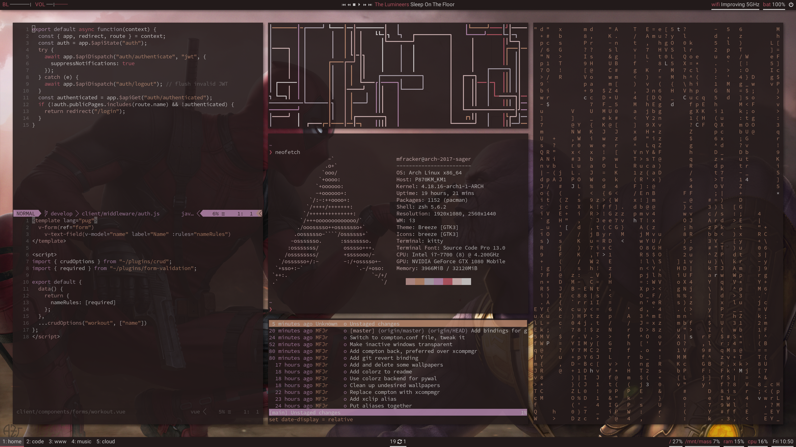

Why are dotfile repositories important? See https://dotfiles.github.io/.

# dotfiles



See the modules folder to see what configs this repo manages.

## Requirements

The following are assumed to be installed:

- ag AKA the silver searcher (required by neovim for searching)
- acpi (required by polybar for battery indicator)
- [color-blend](https://www.github.com/towerism/color-blend) (used for calculating colors)
- colorz (used as a backend for pywal)
- feh (required for background)
- Font Awesome (required by polybar)
- unifont (required by polybar)
- Source Code Pro font (used by oni)
- i3wm
- imagemagick
- pacman-contrib (required by polybar for update checking)
- prezto (for a pleasant zsh experience)
- pulseaudio
- polybar
- ponymix (used for pulseaudio volume control)
- prezto (used for zsh config)
- pywal (used to generate colorscheme from wallpaper)
- Roboto font (required by polybar)
- rofi (required by i3)
- sysstat (required by polybar for cpu usage)
- task
- tig

## Optional

The following are optional:

- compton (optional for cool animations and transparency)
- Franz (for cloud services)
- fzf (commandline fuzzy completion used by zsh and neovim)
- GNU Stow (recommended if you want to run the auto-install script)
- kitty (preferred terminal)
- mopidy (mpd compatible music server)
- mpc (control mopidy/mpd playback)
- Spotify

Here are more optional requirements related to the Language Server Protocol.
You only have to install these if you want LSP-support in neovim:

- vls (vue)
- clangd (c/c++)
- typescript-language-server
- rls (rust) 

## Usage

You may have to remove existing dotfiles if they are not already managed by GNU
stow. After cloning, running the install script will set up the symlinks for
you, as well as install the default theme:

``` bash
$ git clone https://github.com/towerism/dotfiles ~/.dotfiles
$ ~/.dotfiles/install
```

### Themes

This dotfile setup is designed to allow the user to change the theme on the
fly.  Themes can be loaded randomly, or selectively, on the fly based on
wallpapers stored in .wallpapers folder. In addition to `Super+t` which allows
you to select a theme based on a wallpaper, there is a special theme mode for
loading and deleting themes.

## oni

Oni is a modern electron-based editor that combines neovim with the good parts of
editors like Atom and VSCode. The main reason we like oni is because of its support
of the Language Server Protocol. Combine this with the 
[vim-polyglot](https://www.github.com/sheerun/vim-polyglot), and you have a modern
text editor with an authentic vim-feel that is unparalleled by any other text editor.

NOTE: oni is very unstable. I think it's a very good text editor, however I
find a well configured (neo)vim setup preferrable for its stability and
consistency. I will still be maintaining the oni module, just know that I primarily
use neovim by itself.

**Plugin manager**: vim-plug

## i3
This is a modified version of the default config. Window navigation was modified
to mirror vim bindings exactly, so horizontal splitting had to be remapped. I've
also configured certain programs to open to certain workspaces, i.e. oni open
in the code workspaces, and chromium opens in the www workspace. The
configuration also automatically loads the theme that was most recently loaded.

## dunst

Dunst is used for notifications. It hasn't been configured much from default
other than wider notification window. The configuration is generated when
changing themes in order to reflect the whatever the current colorscheme is.

## kitty

The kitty default configuration is sufficient for now. The only thing changed is
the default font.

## polybar

This config shows a pretty status bar at the top of the screen. It shows
battery, storage capacity used, volume, memory and cpu usage, wifi, power menu,
and workspaces that are pinned to the corresponding monitor.

## scripts

Shared scripts.

## task

Task warrior configuration. Contains tasksh specific configs as well as
inthe.am configs for task sync.

## tig

Ncurses git interface. Configured with vim-like keybindings. This configuration
is also inspired by magit which I used for a while when I still used emacs.

## rofi

The preferred application launchered. It is configured to match whatever the
current colorscheme is.

## wallpapers

Contains lockscreen-only wallpapers that don't work with pywal as well as the
wallpapers that can be used with wal. The random-theme script pulls wallpapers
from the wallpapers that are not lockscreen-only.

## zsh

This provides good defaults through the prezto zsh configuration framework,
including fuzzy completion, and git integration. It also uses keychain for
managing ssh-agent across multiple terminals and Xsessions. It creates several
aliases to neovim and makes it the default editor.


